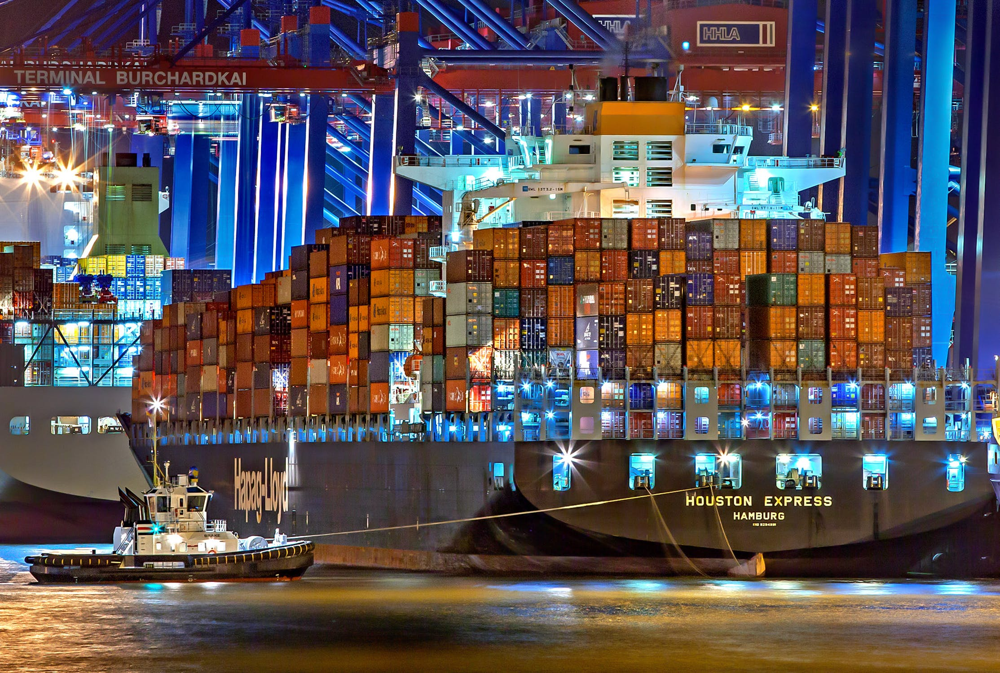

# Route13 Architecture

THIS DOCUMENT IS CURRENTLY A WORK IN PROGRESS

`Route13` is a framework for building simulators and optimizers for transportation networks.
A `Route13` simulation typically consists of a composition of five components:
* **`Generators`**, which produce streams of external events that serve as input to the simulation.
* The **`Clock`**, which is the event queue that drives the simulation.
* The **`Environement`**, which maintains the current state of the world.
* **`Agents`**, which perform actions in the Environment.
* **`Planner`**, which strives to find an optimal ordering of activies for Agents.

## Generators
`Generators` produce streams of external events that serve as input to the simulation. These events might correspond to work orders, like moving a container from a pier to a railcar; equipment downtime for repairs or refueling; or staffing changes for shifts or breaks.

The key characteristic of the Generator event stream is that it is not impacted by actions made by agents in the simulator. A schedule for vessels arriving and departing a container port could be the basis for a Generator, as long as the time required unload and then load each vessel was independent of the routing of the forklifts. If the forklift routing could delay departures, and therefore block new arrivals, it would be necessary to simulate arrival and departure times, instead of playing them back from a schedule.

### Playback Generators
Perhaps the simplest generator is one that plays back recorded events from the reeal world. A container terminal, for example, may have detailed logs of ship arrival and departure times, along with pier assignments and manifests that specify how containers move between gantries and rail cars.

Such a generator may rely on complex [ETL](https://en.wikipedia.org/wiki/Extract,_transform,_load) to generate work orders by joining ship and rail movement logs with manifests, but once the work orders have been composed, the generator need only enumerate them in chronological order.

The playback generator is useful when comparing the performance of optimization algorithms on certain historical days.

### Transforming Playback Generators
Sometimes it is useful to ask "what if" questions, based on a recorded event stream.
Suppose, for example, that an airline has recordings of flight arrival and departure times at a particular airport, along with gate assignments and baggage routing information for connecting flights. When evaluating a planning algorithm, it might be interesting to see how it would perform on the same day, if thunderstorms were to delay afternoon flight arrivals.

Adverse weather can wreak havoc on plans. Bags on planes arriving late may have tighter connection times. Ground stops, diversions, and low fuel situations may change the arrival order and gate assignments at the last minute.

One can build a new generator that layers weather delays on top of the output of a Playback Generator. This approach typically makes use of a simple simulator to determine a plausible sequence of events after adding random delays.

Consider, again, the airport simulation. It is not sufficient to just alter flight arrival times because this could result in two planes occupying the same gate at the same time. A simple, `Gate Assignment Simulator` that models typical aircraft operations relating to taxi times, gate assignment, and turnaround times can fixup the gate assignments in the modified event stream.

The complexity of the of the `Gate Assignment Simulator` depends on the level of fidelity required by the main simulation. The simplest possible gate assigner needs to know which gates are available and which are occupied at any given time. Since late-arriving incoming flights can cause delays in outgoing flights, the gate assigner must have some model for aircraft turn around times and policies.

A more sophisticated gate assigner might incorporate local knowledge and expert heuristics, such as sending a late-arriving domestic flight to the international terminal to facilitate a large group of passengers with tight connections to Paris, or holding a departing flight to allow from connections from a delayed inbound flight.

### Synthetic Generators
Sometimes logs of real-world events are not available. This would be the case for a planned facility or one under construction. The situation also arises when developing generic planning algorithms for a class of facilities with similar capabilities and contraints.

A `Synthetic Generator` uses probability distributions to create a sequence of work orders and resource level changes that conform to a set of business rules.

As with a `Transforming Playback Generator`, a `Synthetic Generator` typically incorporates a small simulator to assign item sources and sinks to the locations of physical infrastructure like piers, loading docks, and gates. The complexity of this simulator depends on the constraints of the physical environment. As an example, a container port might have piers that can accomodate vessels of various sizes. Randomly generated vessels would need to be assigned to unoccupied piers of the appropriate size.

### Implementation of Generators
`Route13` generators interact with the master simulation via the [Agent Pattern](#agent). Generators that contain an internal simulator can use the same agent-driven architecture as the master simulator.

~~~
TODO: SAMPLE generator code
~~~

## Clock
`Route13` is an event-driven simulation framework. Unlike a video game that advances its clock at regular intervals to achieve a desired framerate, `Route13` advances its clock to the time of the next scheduled event.

The `Clock` maintains a priority queue of events, ordered by start time. The main loop of the simulation pulls events out of the queue and runs them. This continues as long as there are events in the queue. When the queue becomes empty, the simulation ends.

The act of processing an event may result in new events being queued. For example, an event that initiates an transfer of items from point A to point B might trigger a chain of events, each enqueued as its predecessor was processed:
* `Move A to B`: instruct cart to drive to A. Then enqueue
* `Arrive at A`: instruct cart to load items. Then enqueue
* `Items Loaded`: instruct cart to drive to B. Then enqueue
* `Arrive at B`: instruct cart to unload items. Then enqueue
* `Items Unloaded`: record task as complete. No follow on event.

It is sometimes desirable for event chains to form loops.
Suppose you want to an external planner to run at regular intervals.
The `StartPlanning` event could trigger plan generation and then enqueue a `FinishedPlanner` event that would apply the new plan and then enqueue a new `StartPlanning` event:
* `Start Planning`: request new plan from planning service. Then enqueue
* `Finish Planning`: apply new plan. Then enqueue `Start Planning`

Event loops typically consult a system shutdown variable, which allows them to break out of the loop, in the case of a time-bounded simulation.

## Environment
The `Environment` maintains the current known state of the world and provides methods, called `estimators`, for predicting the outcomes of various physical processes.

### Physical State
Known state includes physical state, such as the locations of carts; and logical state, such as our best knowledge of upcoming arrivals and shift changes.

As `Route13` is concerned with transportation networks, its physical state consists of the locations of a fleet of carts.
* `Location` - Every location in the environment is associated with a `LocationId`. Locations typically correspond to physical infrastructure like piers, loading docks, and gates. Locations also designate parking lots, fueling stations, and break rooms.
* `Cart` - Transports items from one location to another. Could be a forklift or a baggage cart or a tractor trailer. Carts have unique `ids`, and fields specifying `capacity`, current `payload`, and last known `LocationId`.

Note that `Route13` does not simulate staffing levels. If staffing simulation is desired, it can be implemented as a separate, upstream `Route13` simulator that acts as a `generator`.

### Logical State
`Route13` models the assignment of `Jobs` to `Carts`. At any given time, the environment is aware of a set of `Jobs`, some of which will start in the future, and some which are in progress. The `Environment` receives notification of new `Jobs` from a `Generator`.

The `Environment` supports two types of `Jobs`:
* `TransferJob` - transfers a specified quantity of items from location `A` to location `B`, within a window of time, starting when the items are available at `A` and ending at the delivery deadline.
* `OutOfServiceJob` - takes a cart out of service at a specified location during a window of time. Used to model crew breaks, refueling, repairs, and breakdowns.

### Estimators
The `Environment` is configured with four functions that assist in modelling actions necessary to complete jobs.

* `TransitTimeEstimator` - a function that estimates the time for a cart to move from location `A` to location `B` at a certain time of day. The `Graph` class provides a TransitTimeEstimator` based the [Floyd-Warshall](https://en.wikipedia.org/wiki/Floyd%E2%80%93Warshall_algorithm) shorted path algorithm.
* `RouteNextStep` - a function that gives the next `LocationId` on the shortest path from location `A` to location `B`. The `Graph` class also provides this function.
* `LoadTimeEstimator` - a function that estimates the time to load a certain quantity of items at a certain location and time of day.
* `UnloadTimeEstimator` - a function that estimates the time to unload a certain quantity of items at a certain location and time of day.

##  Agents

### Driver
### Dispatcher
### The Agent Pattern

## Planner

### Next Available
### Nearest Available
### N-move Lookahead
### Linear Programming
### ML Model

### Towers of Hanoi