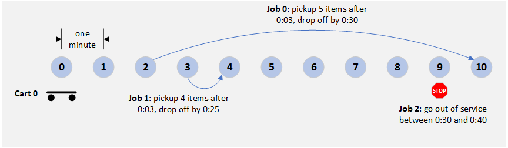
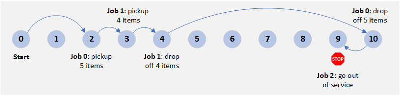

### Route Planning Sample

This sample demonstrates route planning for a single `Cart`. In this case the
`Dispatcher` has assigned the following jobs to a `Cart`:

* `Job 0`: Move 5 items from location 2 to 10 between the times 0:03 and 0:30.
* `Job 1`: Move 4 items from location 3 to 4 between the times 0:03 and 0:30.
* `Job 2`: Go out of service at location 9 between the times 0:30 and 0:40.

We would like to determine ordering of pickups and dropoffs that minimizes working time.

In this sample, the `RoutePlanner` has been configured to print out those routes it considered.
Failed routes are those that were rejected because they violated constraints, such as
delivery deadlines and cart capacities. Successful routes are given a score that represents
the rate at which the cart moves items (items unloaded per unit working time).

~~~
% node build/samples/route-planner-demo.js

=================
Succeeded:

Route for cart 0 (working time = 182163, score = 0.0000494):
PICKUP 5 items at location 2 after 180000 (job 0)
    0: drive for 200s to location 2
    200: wait 179800s until 180000
    180000: load 5 items in 25s.
    180025: completed
DROPOFF 5 items at location 10 before 1800000 (job 0)
    180025: drive for 800s to location 10
    180825: unload 5 items in 10s.
    180835: completed
PICKUP 4 items at location 3 after 180000 (job 1)
    180835: drive for 700s to location 3
    181535: load 4 items in 20s.
    181555: completed
DROPOFF 4 items at location 4 before 1800000 (job 1)
    181555: drive for 100s to location 4
    181655: unload 4 items in 8s.
    181663: completed
SUSPEND at location 9 before 1800000 until 2400000 (job 2)
    181663: drive for 500s to location 9
    182163: suspend operations
    182163: wait 2217837s until 2400000
    2400000: resume operations
    2400000: completed

=================
Failed:

Route for cart 0 (working time = 182155, score = 0.00):
PICKUP 5 items at location 2 after 180000 (job 0)
    0: drive for 200s to location 2
    200: wait 179800s until 180000
    180000: load 5 items in 25s.
    180025: completed
DROPOFF 5 items at location 10 before 1800000 (job 0)
    180025: drive for 800s to location 10
    180825: unload 5 items in 10s.
    180835: completed
PICKUP 4 items at location 3 after 180000 (job 1)
    180835: drive for 700s to location 3
    181535: load 4 items in 20s.
    181555: completed
SUSPEND at location 9 before 1800000 until 2400000 (job 2)
    181555: drive for 600s to location 9
    182155: suspend operations
    182155: wait 2217845s until 2400000
    2400000: resume operations
    2400000: completed
DROPOFF 4 items at location 4 before 1800000 (job 1)
    2400000: drive for 500s to location 4
    2400500: unload 4 items in 8s.
    2400508: CONTRAINT VIOLATED - dropoff after deadline 1800000

=================

... 14 more failed routes and 2 more successful routes ...

=================
Failed:

Route for cart 0 (working time = 1520, score = 0.00):
SUSPEND at location 9 before 1800000 until 2400000 (job 2)
    0: drive for 900s to location 9
    900: suspend operations
    900: wait 2399100s until 2400000
    2400000: resume operations
    2400000: completed
PICKUP 4 items at location 3 after 180000 (job 1)
    2400000: drive for 600s to location 3
    2400600: load 4 items in 20s.
    2400620: completed
DROPOFF 4 items at location 4 before 1800000 (job 1)
    2400620: drive for 100s to location 4
    2400720: unload 4 items in 8s.
    2400728: CONTRAINT VIOLATED - dropoff after deadline 1800000

Considered 16 failed routes.
Considered 3 successful routes.
#########################
Route planning Complete

Route for cart 0 (working time = 180963, score = 0.0000497):
PICKUP 5 items at location 2 after 180000 (job 0)
    0: drive for 200s to location 2
    200: wait 179800s until 180000
    180000: load 5 items in 25s.
    180025: completed
PICKUP 4 items at location 3 after 180000 (job 1)
    180025: drive for 100s to location 3
    180125: load 4 items in 20s.
    180145: completed
DROPOFF 4 items at location 4 before 1800000 (job 1)
    180145: drive for 100s to location 4
    180245: unload 4 items in 8s.
    180253: completed
DROPOFF 5 items at location 10 before 1800000 (job 0)
    180253: drive for 600s to location 10
    180853: unload 5 items in 10s.
    180863: completed
SUSPEND at location 9 before 1800000 until 2400000 (job 2)
    180863: drive for 100s to location 9
    180963: suspend operations
    180963: wait 2219037s until 2400000
    2400000: resume operations
    2400000: completed
~~~

The best route
* picks up 5 items for job 0 at location 2
* picks up 4 items for job 1 at location 3
* drops off those 4 items at loctation 4
* drops off the remaining 5 items at location 10
* goes out of service at locaion 9

