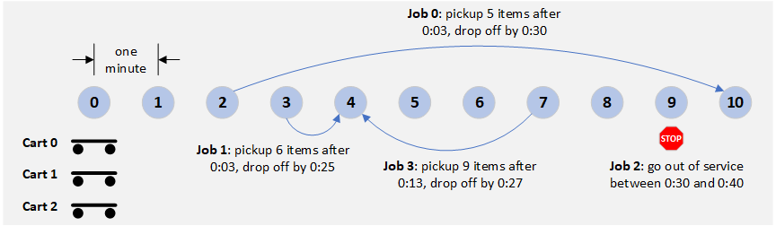

# Hello Route13

The goal of this sample is to demonstrate the steps required to
configure and run minimal simulator.
To keep things simple, we model a small environment with 11 locations, uniformly spaced along a line.
It takes one minute for a cart to move between adjacent locations.
Each item takes 30 seconds to load and 10 seconds to unload.

At time zero, there are 3 carts, each positioned at location 0. We start the simulation with the following jobs:

* `Job 0`: Move 5 items from location 2 to 10 between the times 0:03 and 0:30.
* `Job 1`: Move 6 items from location 3 to 4 between the times 0:03 and 0:25.
* `Job 2`: Go out of service at location 9 between the times 0:30 and 0:40.
* `Job 3`: Move 9 items from location 7 to 4 between the times 0:13 and 0:27.

This simulator makes use of a `Dispatcher` that is configured to assign jobs randomly to carts as the carts become available.

The simulator is configured with a `TextTrace` object that logs status to the console.
Each status line starts with the simulator time, followed by a brief activity description.

Here's the trace output from the simulation:

~~~
% node build/samples/simulator-demo.js

00:00:00 Job 0 assigned to cart 0.
00:00:00 Cart 0 departs location 0 for location 2.
00:00:00 Job 1 assigned to cart 1.
00:00:00 Cart 1 departs location 0 for location 3.
00:00:00 Job 3 assigned to cart 2.
00:00:00 Cart 2 departs location 0 for location 7.
00:01:00 Cart 0 passes location 1.
00:01:00 Cart 1 passes location 1.
00:01:00 Cart 2 passes location 1.
00:02:00 Cart 1 passes location 2.
00:02:00 Cart 2 passes location 2.
00:02:00 Cart 0 arrives at location 2.
00:02:00 Cart 0 waits until 00:03:00.
00:03:00 Cart 2 passes location 3.
00:03:00 Cart 0 begins loading 5 items.
00:03:00 Cart 1 arrives at location 3.
00:03:00 Cart 1 begins loading 6 items.
00:04:00 Cart 2 passes location 4.
00:05:00 Cart 2 passes location 5.
00:05:30 Cart 0 finishes loading (payload=5).
00:05:30 Cart 0 departs location 2 for location 10.
00:06:00 Cart 2 passes location 6.
00:06:00 Cart 1 finishes loading (payload=6).
00:06:00 Cart 1 departs location 3 for location 4.
00:06:30 Cart 0 passes location 3.
00:07:00 Cart 1 arrives at location 4.
00:07:00 Cart 1 begins unloading 6 items.
00:07:00 Cart 2 arrives at location 7.
00:07:00 Cart 2 waits until 00:13:00.
00:07:30 Cart 0 passes location 4.
00:08:00 Cart 1 finishes unloading (payload=0).
00:08:00 Job 1 succeeded.
00:08:00 Job 2 assigned to cart 1.
00:08:00 Cart 1 departs location 4 for location 9.
00:08:30 Cart 0 passes location 5.
00:09:00 Cart 1 passes location 5.
00:09:30 Cart 0 passes location 6.
00:10:00 Cart 1 passes location 6.
00:10:30 Cart 0 passes location 7.
00:11:00 Cart 1 passes location 7.
00:11:30 Cart 0 passes location 8.
00:12:00 Cart 1 passes location 8.
00:12:30 Cart 0 passes location 9.
00:13:00 Cart 1 arrives at location 9.
00:13:00 Cart 1 suspends service at location 9.
00:13:00 Cart 1 waits until 00:40:00.
00:13:00 Cart 2 begins loading 9 items.
00:13:30 Cart 0 arrives at location 10.
00:13:30 Cart 0 begins unloading 5 items.
00:14:20 Cart 0 finishes unloading (payload=0).
00:14:20 Job 0 succeeded.
00:17:30 Cart 2 finishes loading (payload=9).
00:17:30 Cart 2 departs location 7 for location 4.
00:18:30 Cart 2 passes location 6.
00:19:30 Cart 2 passes location 5.
00:20:30 Cart 2 arrives at location 4.
00:20:30 Cart 2 begins unloading 9 items.
00:22:00 Cart 2 finishes unloading (payload=0).
00:22:00 Job 3 succeeded.
00:40:00 Cart 1 resumes service at location 9.
00:40:00 Job 2 succeeded.
Simulation ended.
~~~
